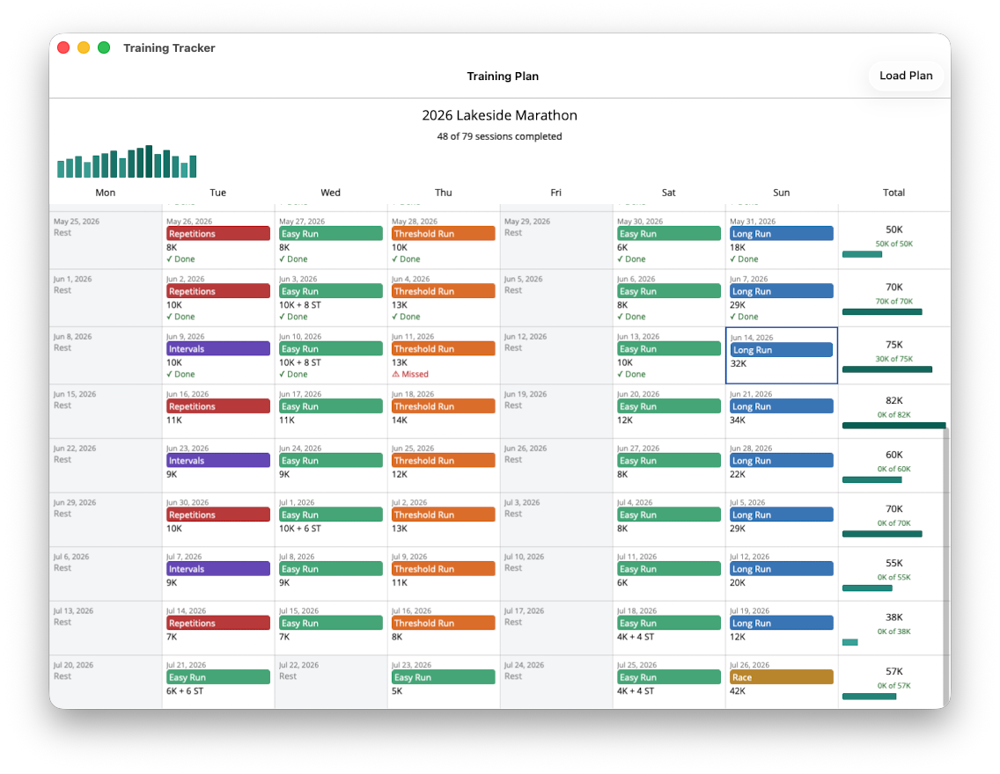

# Training Tracker

An application for tracking progress through running training programmes.



## Motivation

This is a hobby project with two main goals:

1. **Practical utility**: Build a tool to help me stay on top of my running training programme by tracking planned sessions, marking completions, and monitoring weekly progress.

2. **Technical exploration**: Get hands-on experience with AI-accelerated coding whilst re-familiarising myself with the modern .NET ecosystem after some time away from C# development.

## Project Overview

Training Tracker displays a running programme in a calendar view, one week per row from Monday to Sunday, with each day showing its planned session or marking a rest day. A compact bar across the top takes in the whole arc of the programme at a glance, so the build-up and taper are visible without scrolling. Tapping a day checks the session off (and tapping again undoes it), and each week reports the volume completed against the volume planned.

## Features

- **See your whole plan** in a calendar laid out a week at a time, Monday to Sunday.
- **Take in the whole arc** from a slim overview bar, one column per week, sized against the peak week so the build-up and taper read in a single glance.
- **Know which race you're training for** from the programme's title in the header.
- **Tell session types apart** at a glance — easy runs, threshold runs, repetitions, intervals, long runs, pace runs (long runs with portions at race pace), and the race itself are each colour-coded.
- **See rest days** clearly distinguished from training days.
- **Spot strides** tacked onto a run, shown alongside the distance as, for example, `10K + 8 ST`.
- **Check off completed sessions** with a tap, and undo an accidental check-off with another.
- **See what you've actually done** — completed sessions are marked done, and sessions left undone before today stand out as missed.
- **Track your weekly progress** with the completed volume shown against the planned volume for each week, and an overall tally of sessions completed across the programme.
- **See the shape of your programme** through weekly totals colour-coded by how they compare to the peak week.
- **Know where you are today** — the current day is highlighted in the calendar.
- **Start with a clean slate** — the app opens with no plan loaded.
- **Load your own training plan** from a JSON file on disk; your choice is remembered across restarts.

## The training plan file

A plan is a JSON file with an optional `title` and a list of `sessions`. Each session has a date, a type, and a planned distance in kilometres; it may also carry a number of `strides` and a `completed` flag.

```json
{
  "title": "2026 Lakeside Marathon",
  "sessions": [
    { "date": "2026-04-07", "type": "Intervals",    "distanceKm": 8.0 },
    { "date": "2026-04-08", "type": "EasyRun",       "distanceKm": 7.0 },
    { "date": "2026-04-12", "type": "LongRun",       "distanceKm": 12.0, "completed": true },
    { "date": "2026-04-15", "type": "EasyRun",       "distanceKm": 8.0,  "strides": 8 },
    { "date": "2026-07-26", "type": "Race",          "distanceKm": 42.2 }
  ]
}
```

| Field        | Required | Notes                                                                                          |
| ------------ | -------- | ---------------------------------------------------------------------------------------------- |
| `date`       | yes      | The day of the session, as `YYYY-MM-DD`.                                                        |
| `type`       | yes      | One of `EasyRun`, `ThresholdRun`, `Repetitions`, `Intervals`, `LongRun`, `PaceRun`, `Race`.     |
| `distanceKm` | yes      | The planned distance in kilometres.                                                            |
| `strides`    | no       | The number of strides (short accelerations of roughly 100 m) tacked onto the run.              |
| `completed`  | no       | Whether the session has been done; defaults to `false`. The app updates this as you check off. |

Days with no session are rest days. Weeks are derived from the session dates, so there is no need to list rest days or empty weeks.

## Getting started

Training Tracker is a .NET MAUI app currently targeting Mac Catalyst.

1. Install the [.NET 10 SDK](https://dotnet.microsoft.com/) and the MAUI workload (`dotnet workload install maui`).
2. Build and run the app:

   ```sh
   dotnet build -t:Run -f net10.0-maccatalyst src/TrainingTracker.App
   ```

3. Choose **Load Plan** from the toolbar and pick a training plan JSON file (see the format above).

## Technology Stack

- **Language**: C#
- **Framework**: .NET MAUI
- **Architecture**: MVVM, layered along Clean Architecture lines (Domain, Application, Infrastructure, Presentation)

## License

Released under the MIT License. See [LICENSE.md](LICENSE.md).
